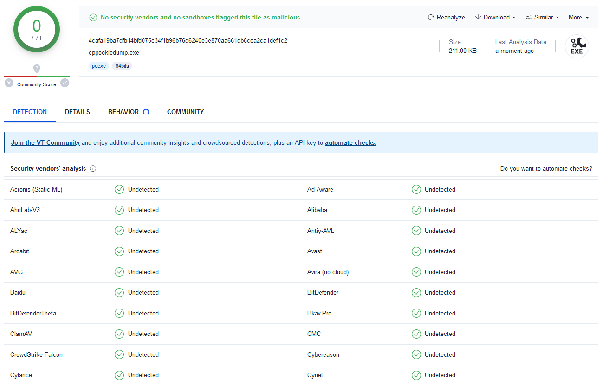

## README
- C++ implementation of [WhiteChocolateMacadamiaNut](https://github.com/slyd0g/WhiteChocolateMacademiaNut).

- Utilizes [cpprestsdk](https://github.com/microsoft/cpprestsdk) to interact with websockets and dump cookies from Google Chrome when launched with remote debugging enabled.

## Usage
`cppookiedump.exe <port>` 
